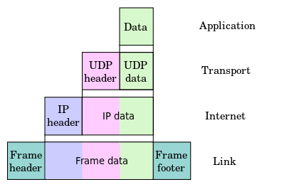

# 基础概念

## 什么是 socket

socket 准确地说是一组应用程序接口，通过这组接口，进程间可以通过类似 unix 标准文件输入(read)输出(write)的方式进行通信。

socket 描述的就是进程间这种通信。

## TCP/IP 协议族

TCP/IP 协议族是一组规定数据如何在网络中进行传输的规约，简单来说它包含传输层、网络层、链路层等不同的通信协议，其中传输层的 TCP/UDP 协议和网络层的 IP 协议是网络编程中最基础、最常见的协议。

一般意义上的网络编程只需要关心 TCP、UDP、IP、HTTP 等协议即可。

## 什么是 TCP

TCP 全称是 Transmission Control Protocol，是建立在 IP 地址、端口、unix stand file 之上的一种全双工传输层协议，TCP 的主要特点是：

- 面向连接
- 提供稳定有序可靠的数据传输（通过诸如超时重发、ack 确认、拥塞控制等策略）

TCP 在 socket 编程中是 stream socket，unix socket 中用 SOCK_STREAM 表示。

详见 http://tools.ietf.org/html/rfc793。

## 什么是 UDP

UDP 全称是 User Datagram Protocol，是一种简单的面向数据报的传输层协议，UDP 不提供类似 TCP 的数据可靠性保证，因而是一种简单的不可靠传输协议，正是由于 UDP 的简单，它的最大特点就是快。

UDP 在 socket 编程中是 Datagram Sockets，unix socket 中用 SOCK_DGRAM 表示。

详见 http://tools.ietf.org/html/rfc768。

## 什么是 IP

IP 是一种唯一的用来辨识计算机在网络中的位置，同时 IP 也是一种协议，是计算机网络协议中的重要组成部分。

IP 分为 4 字节的 IPV4 和 16 字节的 IPV6，前者能够表达的计算机地址是：2^32=4,294,967,296，后者是前者的 2^96 倍。

IPV4 一般用点分法的 10 进制表示，如 192.168.0.1，IPV6 一般用冒号分割的 16 进制表示 2001:0db8:c9d2:0012:0000:0000:0000:0051。

详见 https://tools.ietf.org/html/rfc791。

## 七层网络模型

数据是怎么从 socket 通过协议传送的？答案就是封装 Data Encapsulate。

我们称一个需要传输的数据为一个 packet，一个 packet 需要传递到网络中的另一个进程， 首先这个 packet 需要用应用层协议进行封装，这里是七层模型中的应用层：Application layer (为了叙述方便这里把传输层上面的协议统称为应用层，七层简化为四层)，接着封装之后的 packet 继续被下层协议封装，比如下层是 TCP 协议，七层模型中的传输层：Transport layer，然后再被下层协议封装，比如 IP 协议，七层模型中的：Network layer，最后数据通到达网卡等硬件设备，七层中的物理层：Physical layer。

- Application （HTTP）
- Presentation 
- Session
- Transport (TCP、UDP)
- Network （IP）
- Data Link
- Physical

当 packet 到达网络的另一端，此时又需要对封装之后的 packet 实行相反的过程进行称之为拆包，从而最终获得原始的 packet。

详见:

- https://zh.wikipedia.org/wiki/OSI%E6%A8%A1%E5%9E%8B
- http://www.ha97.com/3215.html

## 字节

为了表述方便，计算机通信数据大小统一以字节为单位，1 byte=8 bit。

## 字节序

数据在网络中是 big-endian （network byte order）的方式存储，即高位在前的存储方式，机器的内存中是以 little-endian （host byte order）的方式存储，即低位在前的方式存储，为了让网络中的字节序和机器本地的字节序一致，必须进行相互转换，为什么？查看详见。

unix 提供转换的函数是：

- htons() host to network short
- htonl() host to network long
- ntohs() network to host short
- ntohl() network to host long

详见:

- [http://www.ruanyifeng.com/blog/2016/11/byte-order.html](http://www.ruanyifeng.com/blog/2016/11/byte-order.html)
- [http://blog.erratasec.com/2016/11/how-to-teach-endian.html#.WVtQKRN94S4](http://blog.erratasec.com/2016/11/how-to-teach-endian.html#.WVtQKRN94S4)

## 文件描述符

文件描述符是一个简单的非负整数，用来表示一个打开的文件，Unix 中一切都是文件，socket 本质上也可以理解为一个文件。

## 计算机是如何交流的

人因为需要交流和沟通，才有了语言，计算机需要交流和沟通，才有了协议。人的交流促成了社交网络，计算机的交流促成了计算机网络，而计算机交流的本质其实是进程的交流，不同计算机上的进程通过 socket 相互通信，socket 提供了进程交流的通道，借助于协议，不同进程说的话才能被另一个进程理解。

计算机就是利用 socket，通过一组组的协议，以太网协议、IP 协议、TCP/UDP 协议进行相互交流的。
