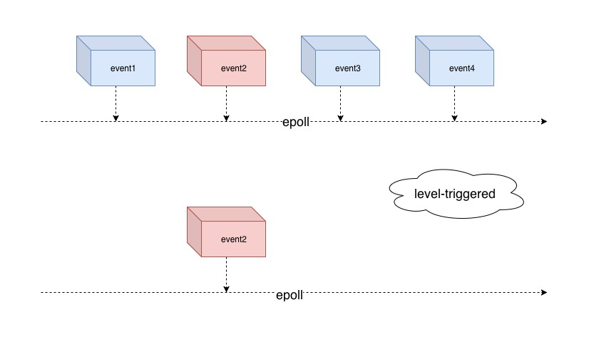
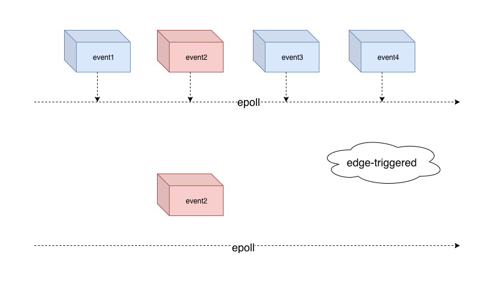

## 8. IO 多路复用之 epoll

前面介绍了 select 和 poll，这一节我们说说另一种 IO 多路复用技术 epoll。


### 8.1 epoll 是什么

epoll 是类似于 poll 的又一个 linux 提供的内核函数，正如 poll 的诞生是为了弥补 select 的缺点，epoll 也是为了 poll 的缺点而实现的。

### 8.2 使用 epoll

同之前一样创建一个回显服务，在使用 epoll 之前首先创建 socket server 以及开始主循环的一些准备工作：

```python
server = socket.socket(socket.AF_INET, socket.SOCK_STREAM)
server.setsockopt(socket.SOL_SOCKET, socket.SO_REUSEADDR, 1)
server.setblocking(0)
server_address = ('localhost', 8000)
server.bind(server_address)
server.listen(10)
message_queues = {}
TIMEOUT = 1
```

进行事件注册和开启主循环：
```python
READ_ONLY = select.POLLIN | select.POLLPRI | select.POLLHUP | select.POLLERR
READ_WRITE = READ_ONLY | select.POLLOUT
poller = select.epoll()
poller.register(server.fileno(), READ_ONLY)

fd_to_socket = {server.fileno(): server}
while True:
    events = poller.poll(TIMEOUT)
    for fd, flag in events:
        pass
```

可以看到 epoll 几乎有着和 poll 一样的 API，有一点不同的是 epoll 支持的事件更多，而且 epoll 的 timeout 是以秒为单位的，poll 是以毫秒为单位的。


### 8.2 读事件 POLLIN 和 POLLPRI

epoll 的读事件对应的是 **POLLIN** 和 **POLLPRI** ，同 poll 读事件几乎一样，同样处理 epoll 读事件主要有以下几种情形。

**情形一**

如果文件描述符是 server，说明有新的连接到来，在获取这个连接之后需要把新的连接通过 epoll 来进行注册，这样我们就可以监听新连接的事件了：

```python

if s is server:
    connection, client_address = s.accept()
    connection.setblocking(0)
    fd_to_socket[ connection.fileno() ] = connection
    poller.register(connection, READ_ONLY)
    message_queues[connection] = Queue.Queue()
```

**情形二**

如果文件描述符不是 server，说明这个文件描述符有数据可读，此时我们可以使用 `recv` 来读取数据：

```python
else:
    data = s.recv(1024)
    if data:
        message_queues[s].put(data.capitalize())
        poller.modify(s, READ_WRITE)

```
与此同时，我们也需要修改这个文件描述符需要被监听的事件类型，在读完数据之后我们需要进行数据回显，因此修改事件类型为 `READ_WRITE`。

**情形三**

如果读取的数据是空的，说明 client 关闭了这个连接，我们需要把这个连接从 poll 的注册列表中移除，并且释放对应的资源：

```python
poller.unregister(s)
s.close()

# Remove message queue
del message_queues[s]
```

### 8.3 写事件 POLLOUT

对有写事件文件描述符的处理和 poll 一样：
```python
elif flag & select.POLLOUT:
    try:
        next_msg = message_queues[s].get_nowait()
    except Queue.Empty:
        poller.modify(s, READ_ONLY)
    else:
        s.send(next_msg)
```

### 8.4 异常处理 POLLHUP 和 POLLERR

`POLLHUP` 说明 client 没有正确关闭连接，`POLLERR` 说明有错误发生，这两种情形我们选择取消对文件描述符的监听，并且释放资源：

```python
poller.unregister(s)
s.close()

# Remove message queue
del message_queues[s]
```

在介绍完 epoll 的基本使用，我们再说说 epoll 的两种执行模式。

### 8.5 epoll 的水平触发和边缘触发

epoll 有两种执行模式，一种是水平触发（level-triggered），一种是边缘触发（edge-triggered），默认是水平触发。

#### 8.5.1 水平触发

level-triggered 意思是如果一个文件描述符就绪了，也就是有事件准备读或准备写，调用 epoll 之后内核会把这个文件描述符从内核拷贝到用户空间，并通知用户对应的事件，如果用户此时选择不处理该描述符的事件，即用户不进行数据读或不进行数据写，下次调用 epoll 时，内核依然会返回这个事件。



如图所示不论 epoll 调用多少次，只要事件 event2 就绪，内核总是会把事件描述符返回给用户。

#### 8.5.2 边缘触发

edge-triggered 意思是如何一个文件描述符就绪了，也就是有事件准备读或准备写，调用 epoll 之后内核会把这个文件描述符从内核拷贝到用户空间，并通知用户对应的事件，如果用户选择不处理该描述符的事件，即用户不进行数据读或不进行数据写，下次调用 epoll 时，内核不会再返回这个事件，除非把对应的事件重新激活，内核才会在下次调用中返回该事件。



第二次调用 epoll 不会返回已经返回过的事件 event2。

### 8.6 两种触发模式的差异

level-triggered 描述的是一种状态，一种存在 present，即事件发生了这一种状态，只要这个状态一直存在，内核就会一直不断的处理，也就是同一个事件可能会被内核反复拷贝。

edge-triggered 描述的是一个事件，一个发生的事件 event，即事件从无到有这一状态的改变，也就是发生了这件事，此时内核才会拷贝这个事件，如果用户没有处理，接下来内核不会再次进行拷贝，即使这个事件在内核中存在，但是这个事件已经发生过了。

level-triggered 模式是尽可能的让事件被用户应用程序感知到，而 edge-triggered 可能的问题是也许会会让用户应用程序错过某些事件，因为它只在事件发生的那一刻才会通知用户。

edge-triggered 更高效，但是 level-triggered 更可靠。

### 8.7 边缘触发的使用

epoll 默认是 level-triggered，如果需要使用 edge-triggered 需要更改注册事件类型以及处理事件的方式。

首先需求修改注册事件类型：
```python

poller.register(server.fileno(), READ_ONLY | select.EPOLLET)
```

其次在需要处理事件时我们必须一次性全部处理完成，accept 处理：
```python
try:
    while True:
        connection, client_address = s.accept()
        connection.setblocking(0)
        fd_to_socket[connection.fileno()] = connection
        poller.register(connection.fileno(), READ_ONLY)

        # Give the connection a queue for data we want to send
        message_queues[connection] = Queue.Queue()
        print_red(' connection {0} is comming ==> '.format(
            connection.getpeername()))
    pass
except socket.error:
    pass
```

读取数据：
```python
data = ''
try:
    while True:
        _data = s.recv(1024)
        if not _data:
            break
        data += _data
except socket.error:
    pass

```

发送数据：
```python
try:
    while next_msg:
        bytelength = s.send(next_msg)
        next_msg = next_msg[bytelength:]
except socket.error:
    pass
```
