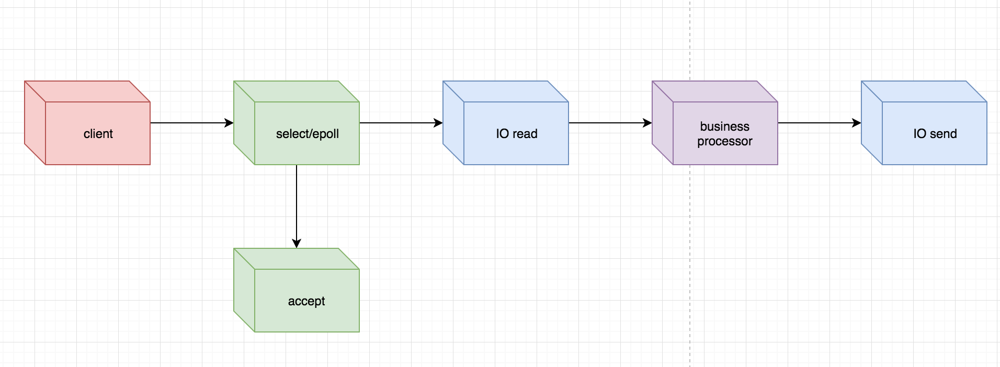
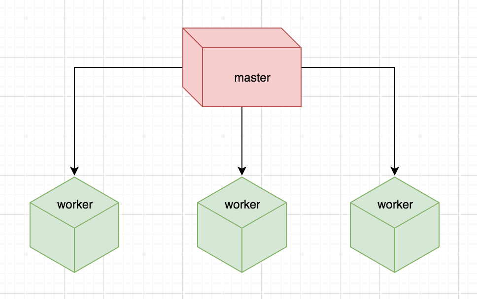

# 高性能 web server

在本系列前面的文章中，我们先后介绍了：
- 单进程模型
- 多进程模型
- 多线程模型
- IO 多路复用技术

每种模型都有自身的优缺点，都有自己的适用场景，比如单进程模型一般仅仅在开发测试中使用，多进程和多线程模型会用在并发请求不是很多的场景下，比如内部系统，数据库系统等，IO 多路复用技术则在很多高性能 web server 中发挥着重要作用，比如我们常见的 nginx。

那如何衡量一个 web server 是高性能的，又如何设计出高性能的 web server？

## 高性能 web server 的衡量指标

可量化是衡量性能的一种重要方式，对于高性能的 web server 可以从以下几个指标入手：

- 最大并发连接数
- 响应时间
- 吞吐量

吞吐量 = 最大并发连接数/响应时间，所以提高一个 web server 的性能就是不断提高这些指标，但是要提高这些指标有一个非常重要的前置条件，就是不能靠单纯提高硬件的性能来达到高性能的要求，而是在逼近硬件性能极限的条件下通过不断优化软件来实现高性能的 web server。

## 高性能的 web server 模型

从单进程模型到 IO 多路复用技术，每种模型都有其自身的特点：
- 单进程模型实现简单，适用场景非常有限
- 多进程模型有一定的并发能力，实现简单，但是数据共享很麻烦
- 多线程模型有一定的并发能力，数据共享比较简单，但是会引入锁机
  制，实现稍微复杂，
- IO 多路复用技术可以有效解决 IO 等待的问题，但是要利用多核优势还需要多进程或多线程。

所以现实中 web server 的实现都是这几种模型的综合应用，组合起来一般包括：
1.单线程 IO 多路复用技术 + 单进程(单进程模型)
2.单线程 IO 多路复用技术 + 多线程(单进程多线程)
3.多线程/多进程 IO 多路复用技术 + 多进程/多线程(多进程或多进程多线程模型)
4.多线程/多进程 + 异步 IO 

不论是采用哪种模型详细处理流程大致如下：

不同模型的差异在于 accept 操作、business process、IO 操作是单个线程完成还是多个线程或多个进程完成。

**单线程 IO 多路复用技术 + 单进程(单进程模型)**

这种模型中，accept 操作、业务逻辑处理、IO 处理都是在一个进程中单线程下处理完成，典型如 tornado、redis。

**单线程 IO 多路复用技术 + 多线程(单进程多线程)**

这种模型中，accept 操作是单独的线程，IO以及业务逻辑处理按照不同场景需求分别交给单独的线程或同一个线程来处理，典型如 gunicorn 支持单进程多线程。

**多线程/多进程 IO 多路复用技术 + 多进程/多线程**

这种模型中，accept 操作是多个的线程或进程实现，IO以及业务逻辑处理也是由多个线程完成或进程完成，典型如 nginx 多进程，每个进程都有自己的 accept

**多线程/多进程 + 异步 IO**

linux 中真正的异步 IO 实现用的还比较少，在此我们不做深入介绍，感兴趣的读者可以看看 Windows 平台的异步 IO 实现 https://docs.microsoft.com/en-us/windows/desktop/fileio/i-o-completion-ports

## 高性能 web server 的实现原则

虽然现在开源实现中各种 web server 细节差异非常大，但总体来说所有的 web server 在实现高性能要求时都遵守类似的原则：
- 尽量避免数据拷贝(Zero Copy)
- 尽量避免上下文切换(Context Switchs）
- 尽量减少内存分配次数(Memory Allocation)
- 尽量减少锁的使用(Lock)

**Zero Copy**

没有数据拷贝的 web server 几乎是不可能实现的，代码复杂度高，而且很难经得起真实场景的考验，即使应用程序能够做到不拷贝数据，但是内核也需要从网络中拷贝数据。既然理想的状态难以达到，我们可以折中实现：尽量避免大对象的拷贝。

**Context Switchs**

在 linux 系统中，如果 web server 进程过多或线程过多都会造成系统在处理请求时需要频繁进行上下文切换，因而一个高性能 web server 的开启的进程数或线程数需要严格控制，一般不大于 CPU 的核心数。

**Memory Allocation**

大量而且频繁的内存分配是高性能的一个致命杀手，为了尽量避免在 web server 大量请求处理过程中内存的频繁分配，可以考虑使用：
- 预分配
- 对象的复用比如使用池化技术
- 避免使用锁

**Lock**

在多线程或多进程的 web server 中锁由于潜在的多线程竞争，锁的使用不可避免，因而我们只能尽量去控制在不需要锁的地方尽量不使用，在需要使用锁的地方控制好锁的粒度。

# 高性能 web server 之 Nginx

Nginx 是什么以及 nginx 能够做什么不是本文讨论的重点，本文的重点是 nginx 使用的 web server 模型，即本系列的主题。

## Master-worker 模型

Nginx 采用的是 master-worker 模型：

master 进程在启动 nginx 时第一个创建的进程，一般以超级权限建立，master 主要负责：

- 读取和校验配置
- 创建、绑定和关闭 socket
- 创建、终止、维护 worker 进程
- 无中断情况下重新更新配置
- 重新开启日志文件
- 等等

worker 进程主要负责：

- connection 的 accept 和 process 
- 反向代理
- 请求过滤
- 等等 nginx 支持的常规功能

也就是说 master 进程在启动时会创建和绑定到指定的 socket，然后 master 进程根据配置(默认选择各个平台最高效的网络 IO 模型，linux 是 epoll) fork 出指定数量的 worker 进程，worker 进程负责通过 master 进程绑定的 socket 进行 accept 和 process 来自 client 的 connection，各个 worker 进程间通过共享内存的方式进行通信，虽然各个 worker 都可以进行 connection 的 accept 但是 nginx 通过文件锁以及各个 worker 进程当前处理 connection 的数量进行评估仅仅选择一个 worker 进程进程新 connection 的 accept。

Nginx 的 worker 进程是默认单线程的，也就是 worker 进程是**单进程模型+IO 多路复用技术**，各个 worker 进程又组成了 **多进程模型+IO 多路复用技术**，不过任意时刻，只有一个 worker 进程能够 accept 新的 connection。

Nginx 的这种 master-worker 的模型能够充分发挥现代 CPU 多核的能力，下图来自网络的 nginx 架构图：

## Nginx 的高性能

Nginx 在 web server 领域的地位是久经考验的，这得益于它的使用简单、性能强劲，nginx 为什么达到如此高的性能标准，结合本系列介绍的各个主题我们一起来分析一下。

**C 语言**

Nginx 是 C 语言编写的，由于 C 语言是最接近系统的底层的高级语言，C 语言的性能几乎是所有高级语言中最好的。

**单进程单线程模型**

不同于传统的多进程以及多线程 web server，nginx 中一个 connection 从 accept 到 process 都是在一个进程的一个线程中完成，完全不需要进行进程或线程的上下文切换，也不需要锁的开销，这就最大程度上保证了单个进程几乎能够跑满单核 CPU（可以在 nginx 配置中指定 worker 进程绑定到具体的 CPU），最大程度上减少对 CPU 时钟的浪费。

**各个平台的高效事件模型**

Nginx 会选择各个平台最高效的网络模型来实现对网络事件的充分利用，比如 linux 下默认是 epoll，macOS 的 kqueue。

**持续的优化**

Nginx 从发布第一版到现在已经过去 10 多年了，在社区以及 nginx 官方的不断努力之下，nginx 持续不断地改进，包括内存分配、锁的利用、尽量少的系统调用等等技术的优化，使得 nginx 越来越高效，特性越来越丰富。

# 高性能 web server 之 Tornado

Tornado 是一个 Python web framework，同时也是一个 networking library，tornado 在 Python 2 上借力于各个平台的 IO 多路复用技术（epoll on linux，kqueue on BSD and Mac OS X ）实现了一个基于事件的 IOLoop ，在 Python 3 上 tornado 的 IOLoop 封装的是 Python 3 的 asyncio 。

## 单线程的 IOLoop

Tornado 的 IOLoop 默认情况下是基于单线程的 ，虽然 tornado 支持在多线程中使用 IOLoop ，但是最终的 IO 处理最终还是要在 IOLoop 所在的线程中执行。

由于 torando 是单线程的，一个显著的问题就是如果一个请求中有阻塞调用，会导致整个 tornado 进程发生阻塞，从而让其他请求变慢甚至不可响应，因此 tornado 推荐在生产环境中启用多个 tornado 进程，每个进程的中的阻塞调用使用多线程或消息队列等异步调用模型。

## Tornado 的高性能

借助于非阻塞的 network IO ，tornado 能够轻松应对大规模的并发连接，因而 tornado 的非常适合在 [Long Polling](http://en.wikipedia.org/wiki/Push_technology#Long_polling) 和 [WebSockets](http://en.wikipedia.org/wiki/WebSocket) 等其他需要长连接的应用程序中使用。

为什么 tornado 能够轻松扩展的数万的连接请求，结合本系列的主题我们来一起分析一下。

**基于事件循环的 IOLoop**

同 nginx 一样，tornado 利用了各个平台的高效的提供的高效的网络 IO 多路复用机制，使得在处理网络 IO 事件非常高效。

**单进程单线程模型**

单线程模型能够有效减少由于上下文切换导致的开销，能够充分利用单核 CPU，而且单线程模型使得编写应用程序无需担心共享资源的从而导致的锁开销，使得资源利用率更高。

**Python 的协程支持**

Tornado 在 Python 2 中实现了协程，在 Python 3 中使用原生的协程，借助协程在 tornado 中可以轻松编写基于多个网络 IO 的并发程序，使得应用程序在等待网络 IO 同时能够处理更多其他的应用程序逻辑，包括处理更多的连接请求。

**异步**

tornado 在处理网络 IO 的时候尽量使用异步执行，比如 tornado 提供的异步 httpClient 在处理 http 请求时可以结合 tornado 提供的携程轻松完成异步 http 请求，可以同时并发执行多个网络 IO 。